# Address Space Layout Randomization
>[!NOTE]
> Originally based off notes from [llan-OuO](https://github.com/llan-OuO).
---
> "ASLR moves executable images into random locations when a system boots, making it harder for exploit code to operate predictably." - Windows

Address Space Layout Randomization (ASLR) in its most basic form *randomizes* the base address of the executable image when it is loaded into memory at run-time. The Windows operating system does support additional mechanisms to increase the protections afforded by ASLR, as discussed in [Methods of Enhancing ASLR](#methods-of-enhancing-aslr). However, there still exist limitations in the current implementations of ASLR in Windows systems, which are further discussed in [Possible attacks bypassing and weaknesses with Windows ASLR](#possible-attacks-bypassing-and-weaknesses-with-windows-aslr). As there is no runtime overhead induced by Windows's implementation of ASLR, having only a limited impact on executable load times, there are few reasons you would not enable ASLR on a DLL or EXE file.

## ASLR Basics
At a high level, when ASLR is enabled on a binary in Windows, the operating system relocates the base address of the loaded binary such that the starting virtual address is randomized, and the loader will patch any references within the code so the modified base address is taken into account as discussed in [Window's Implementation of Relocation](#windows-implementation-of-relocation). This write-up will attempt to answer the following questions:

- What in relation to the binary image is randomized (relocated to an unexpected memory location) when a process with ASLR enabled starts?
- When do these relocations occur, and what performs those relocations for each module of the process?
- How does Windows implement relocation?
- What weaknesses exist in the Windows implementation, and how might they be exploited?
- What enhancements exist for ASLR to overcome some of these weaknesses?

## What is randomized by ASLR
When a binary has been loaded into memory, there are a variety of structures allocated to manage the process and its threads, in addition to various regions of memory that are allocated to contain the code, data, and runtime allocations. When you have linked a process with [`/DYNAMICBASE`](https://learn.microsoft.com/en-us/cpp/build/reference/dynamicbase-use-address-space-layout-randomization?view=msvc-170), then not only is the *Base Address* of the EXE or DLL randomized, but the addresses some of the structures contained within will also be randomized [8][13]. The structures whose addresses are randomized include the [Process Environment Block](https://learn.microsoft.com/en-us/windows/win32/api/winternl/ns-winternl-peb) (PEB) and [Thread Environment Block](https://learn.microsoft.com/en-us/windows/win32/api/winternl/ns-winternl-teb), as these structures contain information commonly used by exploits to bypass system protections and access loaded libraries; It should also be noted that the PEB will be randomized regardless of how you set the `/DYNAMICBASE` flag but this is still a form of ASLR [9]. Additionally, the base addresses of the Stack and Heap are randomized, which reduces the effectiveness of various attacks, including those that perform [*Heap Spraying*](https://en.wikipedia.org/wiki/Heap_spraying). The starting address of the Text and Data sections will have their starting addresses randomized the first time the process is loaded and executed.

> [!NOTE]
> You should be aware that EXE's and DLL's have differing levels of *Entropy*; that is, the number of possible locations the base address can be randomized to start at is different. This is discussed further in the [Entropy](#entropy) section.

## When and what will handle the relocation?
The following section will discuss the characteristics of when a file type or section will be relocated and which system process will perform the randomization.

- Executables:  The *program loader* will select a randomized base address for the image when an ASLR-compatible image is loaded into memory. At this time, it will also perform the patching required for any relocations as described in [Window's Implementation of Relocation](#windows-implementation-of-relocation). It should be noted, based on observations in [7], that it is possible for EXEs to be loaded at the same base address when ASLR is enabled if they are executed again immediately after exiting.
- DLL: The OS Kernel will randomize the base address of a DLL the first time it is used/loaded on the system during the current session, the base address will not be randomized again until all processes using the DLL have exited and it is freed from memory. Although it should be noted that it is likely the DLL will be loaded into the same address it previously occupied, the best way to guarantee a new address is chosen is to reboot the system [7][9].
- Stack: The OS Kernel will randomize the base address of the stack when a thread is started if the process containing this thread is ASLR-compilable. Additionally, the starting offset within the stack may be randomized [9].
Heap: The heap manager always randomizes the base address of a heap when it is created, regardless of whether an image is linked with the `/DYNAMICBASE` flag.

## Window's Implementation of Relocation
> "With Windows, the code is patched at run time for relocation purposes." - [Will Dormann](https://insights.sei.cmu.edu/blog/differences-between-aslr-on-windows-and-linux/)

The file format used for both Win32 and Win64 systems is the Portable Executable (PE) format. Several differences are apparent in terms of how ASLR is handled when compared to the Position-Independent Executable (PIE) ELF format used in Linux, which compiles the source code into position-independent instructions, allowing them to be loaded anywhere without patching (hence the term *position-independent*). The PE file format for Windows is **position-dependent**, which means the **program loader** at **load time** will **patch the program** so that the code can execute from the particular memory location it has been moved to. 

When an executable is created, the linker sets a preferred base address where the executable will be mapped to in (virtual) memory when it is being loaded for execution. This address is stored in the PE header's `IMAGE_OPTIONAL_HEADER` field (For Win32 executables and DLLs, the default base address is `0x400000` [2]). If the executable needs to be relocated to a different base address, the *program loader* needs to locate where it should modify code and data in the binary executable to ensure the program can still function normally. The information on locations requiring modifications is structured as a **relocation table**  stored in the `.reloc` section of a PE file. The table in the `.reloc` section is what the *program loader* uses to patch the executable while it is mapping it into memory to ensure the loaded image continues to work after it has been relocated.

> [!NOTE]
> "The `.reloc` section is a list of places in the image where the difference between the linker assumed load address and the actual load address needs to be factored in." [2]

As the code within the `.text` segment is not *position-independent*, the `.text` and `.data` sections will have their base addresses relocated as large units. That is, if there are two functions in the `.text` segment, the number of bytes between them (relative offset) will remain the same no matter where the `.text` segment is relocated to [7]. The same holds true for the `.rdata` or the `.data` section containing static or global variables; the number of bytes between the contents within (relative offsets) will remain the same [7]. As the stack and heap are not part of the executable image and are created at load time, the compiled code does not make assumptions about their location in relation to the base address, and their location in the virtual address space can be randomized with fewer restrictions and do not require patching or entries in the `.reloc` section; this also holds true for memory mapped files.

<!-- 
> [!NOTE]
> This is why we can see a difference between the entropy observed in Top-Down allocations and Bottom-Up allocations?
-->
## Entropy
Entropy is the measure of randomness in a system. In our case, the entropy involved in ASLR is related to the number of bits within an address we are able to randomize. For every additional bit within the address we can randomize we double the number of possibilities, e.g, If we were to have 12 bits of randomness, we would have `2^12` possibilities, and with 13 bits of randomness, we would have `2^13` possibilities.

The addresses for 32-bit and 64-bit processes have a differing amount of bits that can be randomized. With 32-bit EXEs, there are only 8-bits that can be randomized in the virtual address, providing an *entropy* of `2^8`, which means there are 256 possible addresses the EXE can be loaded at [7]. This is a trivially small number to brute force! As for Windows 32-bit DLLs, the number of bits that can be randomized increases to 14, giving `2^14` possible addresses the DLL can be loaded at [8]. This is better but still only provides 16k options, which is still possible to brute force within reason.
> [!NOTE]
> The only bits that can be randomized in the 32-bit EXE are 8-bits relating to the directory page table entry and page table offset. Specifically, these are bits 16 - 23. This is because the Virtual Address is separated into various fields, bits 0 - 11 (12-bits) provide the offset of the entry within a 4k page and cannot be randomized without breaking the program. The next 18 bits are used for page table and directory offsets (9-bits each), and the last 2 are used as a directory table selector when accessing > 4 GB of RAM. Only 14 bits of the Directory and Page Table offset bit fields can randomized, as previously mentioned. [7]
>
> 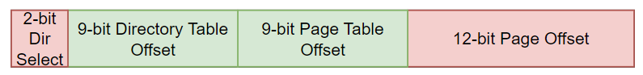

With 64-bit EXEs and DLLs, Windows can randomize 17-19 bits of the virtual address [7], providing a higher level of entropy, making it much harder to brute-force or guess the base address an image will be loaded at. Below is the amount of entropy for images loaded at a given base address.

Based on the Microsoft Documentation in [8] the following *entropy* is provided:
- DLL images based above 4 GB: 19 bits of entropy (1 in 524,288 chance of guessing correctly)
- DLL images based below 4 GB: 14 bits of entropy (1 in 16,384 chance of guessing correctly).
- EXE images based above 4 GB: 17 bits of entropy (1 in 131,072 chance of guessing correctly).
- EXE images based below 4 GB: 8 bits of entropy (1 in 256 chance of guessing correctly).

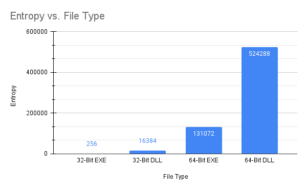

> [!NOTE]
> 32-bit EXEs and DLLs have a limit on their entropy as they are loaded below the 4GB threshold. However, the 64-bit EXEs and DLLs can be based below the 4 GB threshold; therefore, the Windows system prioritizes basing 64-bit EXEs and DLLs above the 4GB threshold so it can make use of the higher entropy provided.

## Methods of Enhancing ASLR

### Randomize memory allocations (Bottom-up ASLR)
> Randomizes relocations for virtual memory allocations. - Microsoft

Bottom-up memory allocation is commonly used as the default virtual memory allocation method when searching for a free region of memory. This method starts searching from the bottom of the address space and selects the first free region of the requested size [8]. For example, the [`VirtualAlloc(...)`](https://learn.microsoft.com/en-us/windows/win32/api/memoryapi/nf-memoryapi-virtualalloc) function call allocate a region of memory in the virtual address space, and its default method of searching is *Bottom-Up* [8]; though you can use the flag `MEM_TOP_DOWN` to perform a Top-Down allocation with this function.

Bottom-up ASLR enables random base addresses for bottom-up allocations. This, in addition to Top-Down randomization, adds explicit randomness to the rebasing of the DLLs or EXEs image. This is accomplished by randomizing the address the Top-Down or Bottom-Up allocations start searching from when the image is loaded [8]. 

This is only applied to images that explicitly enabled and opt-into ASLR with the `/DYNAMICBASE` flag, this is due to compatibility reasons to prevent issues in applications which do not expect their address space layout to change randomly between executions [10]. Additionally programs that perform pointer truncation, that is storing a 64-bit pointer in a 32-bit variable (e.x. `int` or `unsigned int`) will be incompatible with the hight-entropy option in 64-bit processes [15].

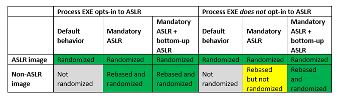

<!-- > [!NOTE]
> This feature can be applied system-wide or to individual processes by opting into ASLR. -->

#### Enabling Bottom-Up ASLR System Wide

1. Open your system settings.

   

2. Open the Security Settings.

   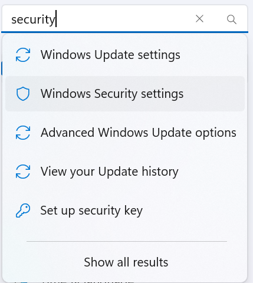

3. Open the *App & Browser Control* settings page.

   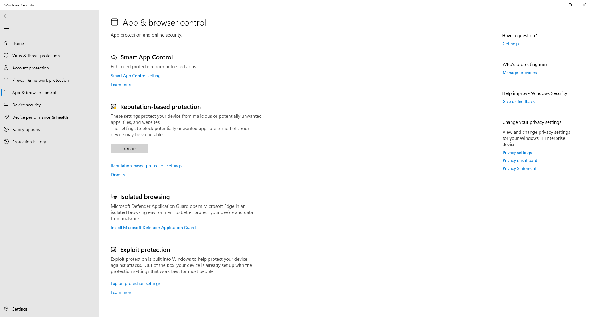

4. Open the *Exploit Protection* page, this is generally located at the bottom of the list.

   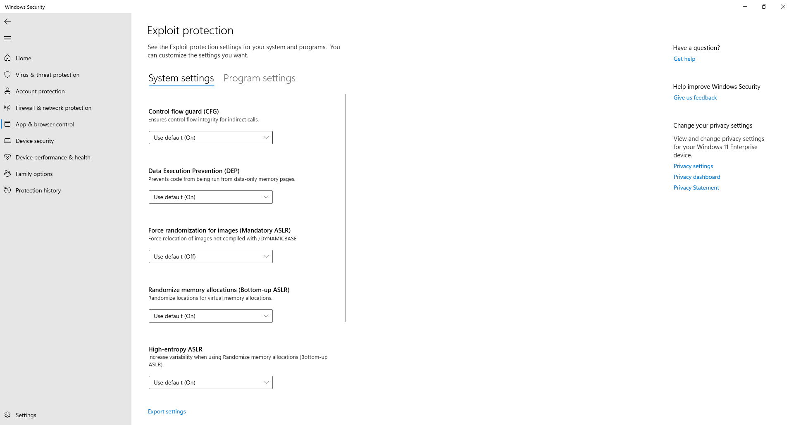

5. Modify the *Bottom-Up ASLR* settings as desired and restart the machine.

   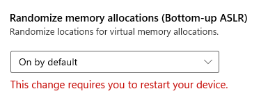

> [!NOTE]
> Now, processes that opt-in to ASLR will also have Bottom-Up ASLR enabled.

### Force randomization for images (Mandatory ASLR)
> Force relocation of images not compiled with `/DYNAMICBASE` - Microsoft

Mandatory ASLR is a system-wide setting that enforces image rebasing for all DLLs and EXEs regardless of whether they are linked with the `/DYNAMICBASE` flag that specifies they are ASLR compatible [8][15]. **Notice**, this is different from ASLR-compatible relocation because mandatory ASLR will only rebase the image using a different base address than the preferred one, whereas if the `/DYNAMICBASE` linker flag was used Bottom-Up ASLR would also be applied to randomize the placement of the stack and heap within its virtual address space [14]. It should be stressed that this is because forced ASLR will mimic the behavior observed when the system attempts to load two images at the same base address [8], meaning this rebasing is predictable and does not have any entropy [15]. If you would like to have entropy included with the Mandatory ASLR, we should enable this with Bottom-Up ASLR using a [workaround](https://msrc.microsoft.com/blog/2017/11/clarifying-the-behavior-of-mandatory-aslr/#workarounds) [10][15].

> [!IMPORTANT]
> As we are forcing ASLR rebasing on images that do not have the `/DYNAMICBASE` flag set to signal support for ASLR there may be various compatibility issues. This can range from performance issues due to a decrease in page sharing, as mentioned in [8], to unpredictable errors due to uncontrolled control flow jumps in binaries where the compiler stripped out relocation `.reloc` information or made assumptions about the base address of the image [15].

#### Enabling Mandatory ASLR
> [!IMPORTANT]
> This section is for your information; you do not need to enable Mandatory ASLR on your system!

1. Open your system settings.

   

2. Open the Security Settings.

   

3. Open the *App & Browser Control* settings page.

   

4. Open the *Exploit Protection* page; this is generally located at the bottom of the list.

   

5. Modify this setting and restart the machine.

   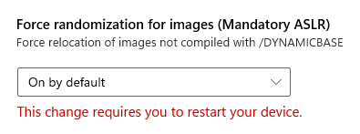

### High-entropy ASLR
> Increase variability when using randomized memory allocations (Bottom-up allocation). - Microsoft

The size of the address we use and the number of bits available for randomization limit the entropy of our system when randomizing the virtual address of image bases and the objects within. By increasing the number of bits in the address from 32-bits to 64-bits and therefore increasing the virtual address space we are increasing the entropy available for the random allocation [8]. As the size of the virtual address space was limiting the entropy of ASLR.

> [!NOTE]
> 64-bit EXEs linked with the `/LARGEADDRESSAWARE` flag to specify they support  for over 2 GB of address space will receive only 8 TB in Windows 8, and in modern versions of Windows, they will receive 128 TB of virtual address space (48-bit virtual addresses) whereas 32-bit applications will only receive 2 GB by default. [8]

High-entropy ASLR introduces 1 TB  of variance with 24-bits of entropy for virtual memory allocations. In previous versions of the Visual Studio compiler, the linker options used to control this [`/HIGHENTROPYVA`](https://learn.microsoft.com/en-us/cpp/build/reference/highentropyva?view=msvc-170&redirectedfrom=MSDN) was disabled by default; however based on the current documentation this is now enabled by default for 64-bit EXEs and is ignored for 32-bit EXEs. In order to modify this, we would need to manually add this linker option in the *Additional Options* window of the *Command Line Linker Options* in the project's properties.

This feature must be enabled on a per-application basis for compatibility reasons. For example, this may be because some 64-bit executables contain pointer-truncation issues, which were discussed previously [8].

More information on entropy can be found in the previously discussed [Entropy](#entropy) section.
#### Enabling High-Entropy ASLR System Wide
1. Open your system settings.

   

2. Open the Security Settings.

   

3. Open the *App & Browser Control* settings page.

   

4. Open the *Exploit Protection* page; this is generally located at the bottom of the list.

   

5. Modify the *High-Entropy ASLR* settings as desired and restart the machine.

   

## Possible attacks and weaknesses
### Weaknesses
As DLLs are shared between processes, and the DLL's code will be patched when it is loaded in memory; the DLL will have the same base address for all processes that are using it. This is because if a DLL were to have its base address randomized each time it is loaded by a process and has its contents patched to reflect the new base address, then all the processes that previously loaded the DLL would no longer have the correct addresses mapped into their memory spaces. This means if you discover the base address of the DLL in one process, you know the base address of the DLL for all processes using it on the system [7]. This is why tools that locate where DLLs or functions are located like [arwin](https://github.com/xinwenfu/arwin) work with ASLR enabled processes.

If a process restarts quickly enough, then it may re-use the same base address where it was previously loaded in memory [7]. This means ASLR may not be re-applied between executions of the process limiting the difficulty attackers will face in exploiting the program.

If a process is a 32-bit EXE, its entropy is extremely limited. If you are using a 32-bit DLL, then the possible locations it can be loaded at (entropy) is also limited, but not to the same degree [7][8].

The `.text` and `.data` sections are relocated as units since the code is not position-independent and requires relative offsets. Attackers may use the fact that the relative offsets between functions or between data are consistent between non-ASLR and ASLR enabled processes of the executable. For example, as shown in the [VChat_Brute_Force](https://github.com/DaintyJet/VChat_Brute_Force) writeup, an attacker can use the relative offsets to successfully perform a brute force attack. 

Although it may be seen as a problem, as shown in [14], Microsoft has announced in [10] that the following is intended behavior; however, it still induces some vulnerabilities if you are not aware of the following. In Windows 10, if you enabled forced ASLR, then [Bottom-Up ASLR](#methods-of-enhancing-aslr) is not enabled for processes not linked with the `/DYNAMICBASE` flag, unlike in previous Windows versions. This is because in previous versions, enabling forced ASLR would treat all programs as though they were linked with the `/DYNAMICBASE` flag, now this is no longer the case [10].

ASLR does not protect against information leaks; if an attacker can leak the address of a pointer or the address of a call to a DLL function, then they have the required information to start defeating ASLR. This can be done by overwriting the null terminator of a string and coercing the program to output this information back to the attacker [11].
### ASLR Only Bypass
 - Address space information disclosure
    > For example, this can occur if an attacker can overwrite the NUL terminator of a string and then force the application to read from the string and provide the output back to the attacker [4].  The act of reading from the string will result in adjacent memory being returned up until a NUL terminator is encountered. [2]

 - Brute forcing 
    * This attack requires the target application to be capable of restarting after crashes and performing the restarts without a limit. You can limit the number of times a program restarts in Windows!
    > Applications that may be subjected to brute force attacks (such as Windows services and Internet Explorer) generally employ a restart policy that is designed to prevent the process from automatically restarting after a certain number of crashes have occurred. It is, however, important to note that there are some circumstances where brute force attacks can be carried out on Windows, such as when targeting an application where the vulnerable code path is contained within a catch-all exception block. [2]

 - Partial overwrite
    > Certain types of vulnerabilities can also make it possible to bypass ASLR using what is referred to as a partial overwrite.  This technique relies on an attacker being able to overwrite the low-order bits of an address (which are not subject to randomization by ASLR) without perturbing the higher-order bits (which are randomized by ASLR). [2]

### ASLR with DEP Bypass
> At this point in time, there have been multiple exploits that have demonstrated that it is possible in practice to bypass the combination of DEP+ASLR in the context of certain application domains (such as browsers and third-party applications). These exploits have bypassed ASLR through the use of predictable DLL mappings, address space information disclosures, or JIT spraying and have bypassed DEP through the use of return-oriented programming (or some simpler variant thereof) or JIT spraying. In many cases, these exploits have relied on predictable mappings caused by DLLs that ship with third-party components or by JIT compilation capabilities included in non-default browser plugins. This means that these exploits will fail if the required components are not installed. [2]


## How to enable ASLR for Windows applications?
> "ASLR compatibility on Windows is a link-time option." [6]

In Windows, ASLR can be enabled on a per-image basis by using the `/DYNAMICBASE` linker option while the image is being linked to *opt-in* to ASLR. To support ASLR, not only should the image being loaded support ASLR but also all components it loads (DLLs) must also support ASLR [1]. In Windows Vista and later, system DLLs and EXEs are ASLR-enabled by default .

> [!NOTE]
> The [Forced ASLR](#force-randomization-for-images-mandatory-aslr) section discusses how we can enable ASLR on a system-wide setting, forcing all processes to randomize their base address regardless of whether they opted into ASLR or not.

1. Open the Visual Studio Project.
2. Open the project's properties setting.

   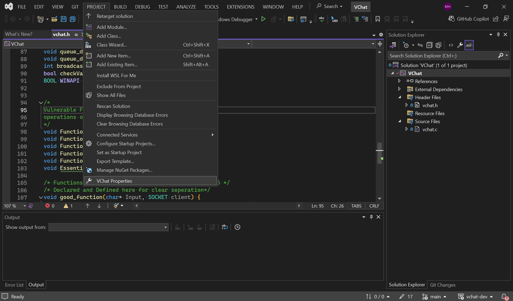

3. Open the `Linker` -> `Advanced` setting.

   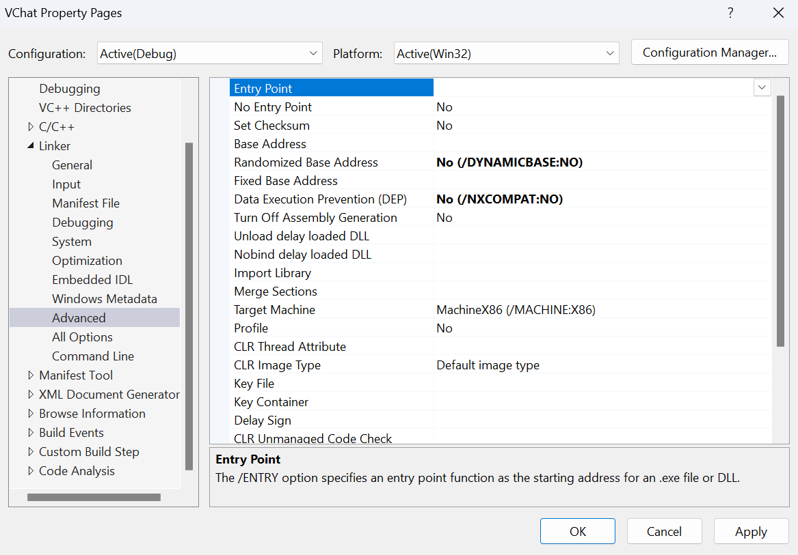

4. Set the `/DYNAMICBASE` flag to *opt-in* to ASLR.

   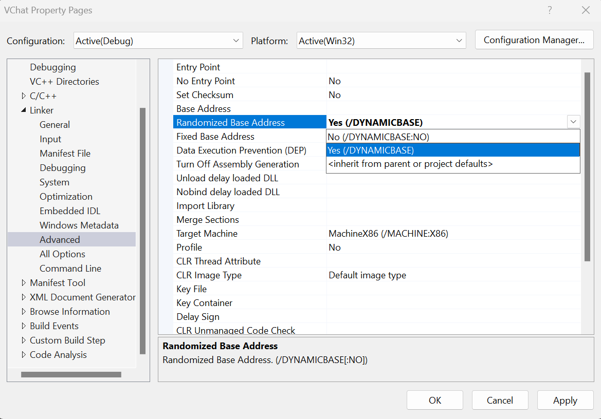

5. If you are using a 64-bit system, the `\LARGEADDRESSAWARE` and `/HIGHENTROPYVA` flags to use the entropy provided by a larger address space are enabled by default and will be ignored for 32-bit applications. The `\LARGEADDRESSAWARE` flag can be found in the `Linker` -> `System` -> `Enable Large Addresses` setting. There is no apparent options for the `/HIGHENTROPYVA` flag, so this can be configured in the `Linker` -> `Command Line` -> `Additional Options` window.

## Exploring Windows ASLR
In this section, we will explore the actual effects of ASLR on both 32-bit and 64-bit processes. For this, we provide a variety of programs in the [SRC](./SRC/) directory, and they are discussed individually bellow. Additionally, we use [Immunity Debugger](https://www.immunityinc.com/products/debugger/) to examine a 32-bit process, and [WinDBG](https://learn.microsoft.com/en-us/windows-hardware/drivers/debugger/) to examine a 64-bit process. Before we jump into the example programs, we will look into how we can check if a process supports ASLR or not.

### Examine ASLR Support
In order to verify whether a process has ASLR enabled or not, we will use two tools; the first is the command line tool [dumpbin](https://learn.microsoft.com/en-us/cpp/build/reference/dumpbin-command-line?view=msvc-170) included as part of the Visual Studio development package, and the second being a part of the [Sysinternals](https://learn.microsoft.com/en-us/sysinternals/) suite of tools [Process Explorer](https://learn.microsoft.com/en-us/sysinternals/downloads/process-explorer).


#### Dumpbin
Utilizing `dumpbin`, we will be able to verify whether or not a process will support ASLR when it is loaded by examining the headers in the PE file. This can be done without loading and executing the process.

1. Open a *Developer PowerShell for Visual Studio*.

   

2. Navigate to the directory containing either the example process or VChat.

   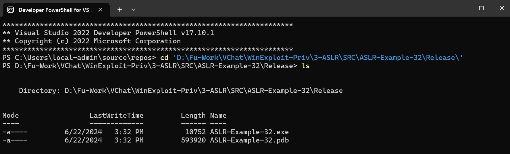

3. Use the `dumpbin` tool command shown below to examine the PE file fields.

   ```
   dumpbin.exe /headers .\ASLR-Example-32.exe
   ```

   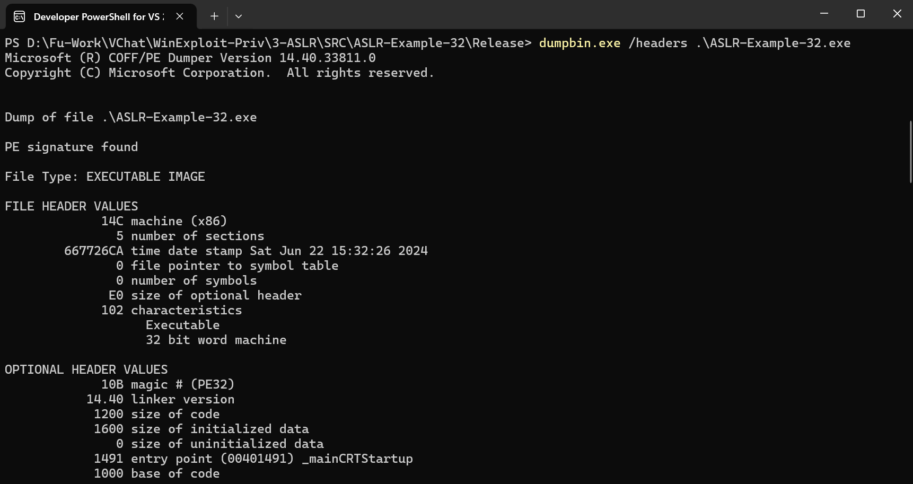

4. Examine the *Optional Headers*, we can see there is [Dynamic Base Characteristic](https://learn.microsoft.com/en-us/windows/win32/debug/pe-format#dll-characteristics).

   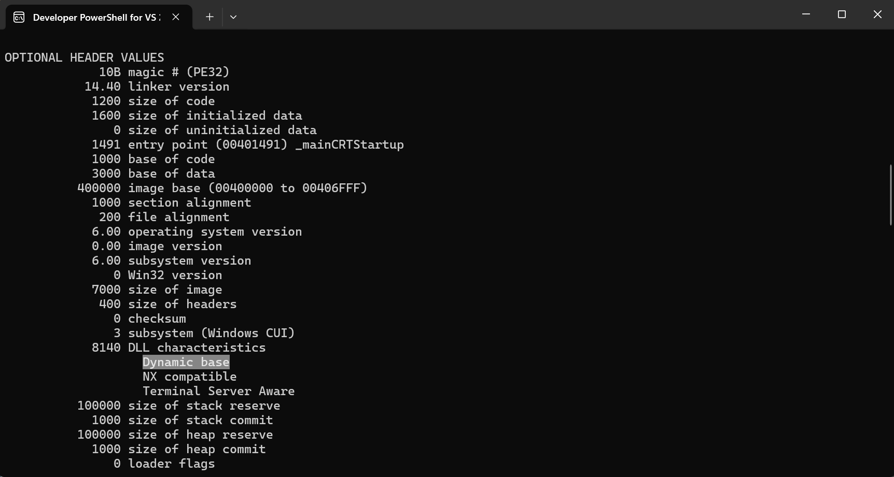

#### Process Explorer
By using Process Explorer, we can see which processes running on the system support ASLR or not. 

1. Open Process Explorer.

   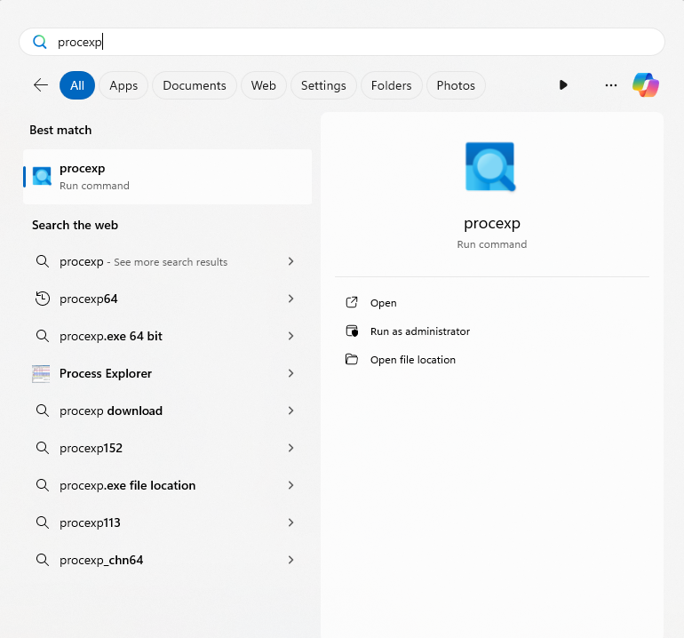

2. Right-click the Column Headers, and click *Select Column*.

   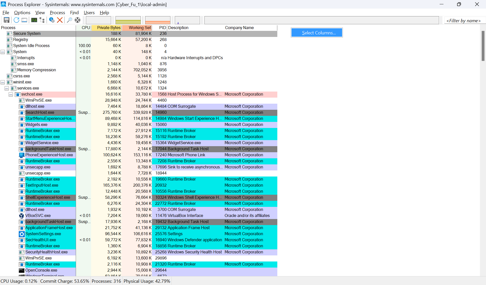

3. Show the *ASLR Enabled* column.

   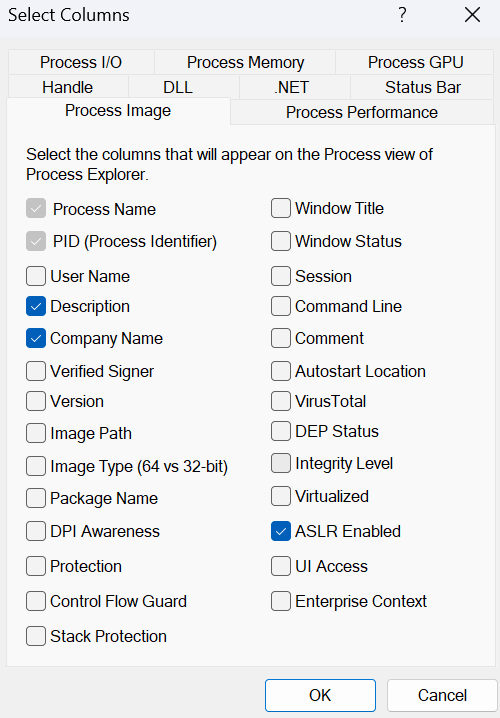

4. View the ASLR-enabled processes.

   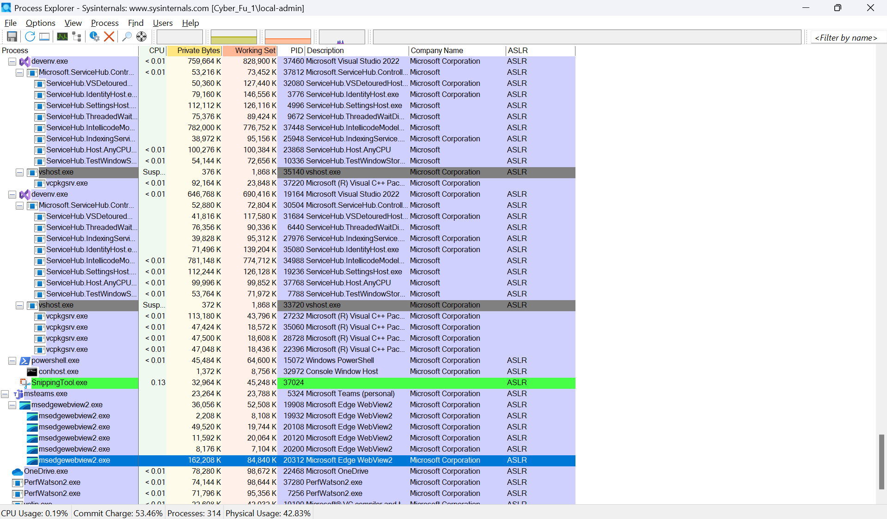

### Example Program 1 (x86)
This first program is configured to compile into a 32-bit executable. It should be noted that there are inconsistencies between the visual placement in the C source code and the placement of values on the stack the Visual Studio C++ compiler generates for local variables; this does not affect our program as the variable we use to output the stack values to the command line is in an acceptable location.


Our code contains the following points of interest:
1. We use inline assembly to find the address of an instruction contained within the `.text` section. This is stored in the variable `j` and later printed to the console.
   ```c
   __asm {
        LABEL: mov edx, LABEL
        mov j, edx
    }
   ```
2. We perform an allocation on the process's heap using the C-Standard library function `malloc(...)`.
   ```c
   // Allocating on heap using c std lib
    m_ptr = (void*)malloc(sizeof(char) * 2);
    *((char*)m_ptr) = "A";
   ```
3. We allocate a new Heap in Virtual memory with `HeapCreate(...)` and perform an allocation within it using `HeapAlloc(...)`.
   ```c
   // Allocate on a heap we allocate
    h_heap = HeapCreate(HEAP_GENERATE_EXCEPTIONS, 0, 0);
    h_ptr = HeapAlloc(h_heap, HEAP_GENERATE_EXCEPTIONS, sizeof(char) * 2);
    *((char*)h_ptr) = "B";
   ```
4. We allocate a region of Virtual Memory with `VirtualAlloc(...)`.
   ```c
   // Virtual Allocation of a page
    v_ptr = VirtualAlloc(NULL, sizeof(char) * 2, MEM_COMMIT, PAGE_READWRITE);
    *((char*)v_ptr) = "C";
   ```
5. We allocate a constant global variable in the `.rdata` section.
   ```c
   // Create a constant global variable should be in rdata
   const char* const_global = "HELLO WORLD";
   ```
6. We allocate a static variable in the `.data` section.
   ```c
   // Create a static global variable should be in data
   static char* static_global = "HELLO WORLD TWO";
   ```
7. We allocate an object that is initially an entry in the `.bss` section in the PE file which is later mapped into a `.data` section.
   ```c
   // Create a global that should be placed in bss
   int bss_data;
   ```
8. We print out data allocated on the stack.
   ```c
   // Printing out the stack
    printf("\nSTACK DATA:\n");
    for (test, s_ptr = &test; test < STACK_NUM; test++, ++s_ptr)
        printf("%-2d: %08p %08x\n", test - 1 , (void*)s_ptr, (*s_ptr));
   ```
> [!NOTE]
>  The line `#define INT` is used to control if debugging interrupts are included in the resulting executable at locations where we would like to stop execution to examine the stack.
#### ASLR Enabled
1. Open the [`ASLR-Example-32`](./SRC/ASLR-Example-32/ASLR-Example-32.sln) Visual Studio Project.
2. Open the Properties Window for the project.

   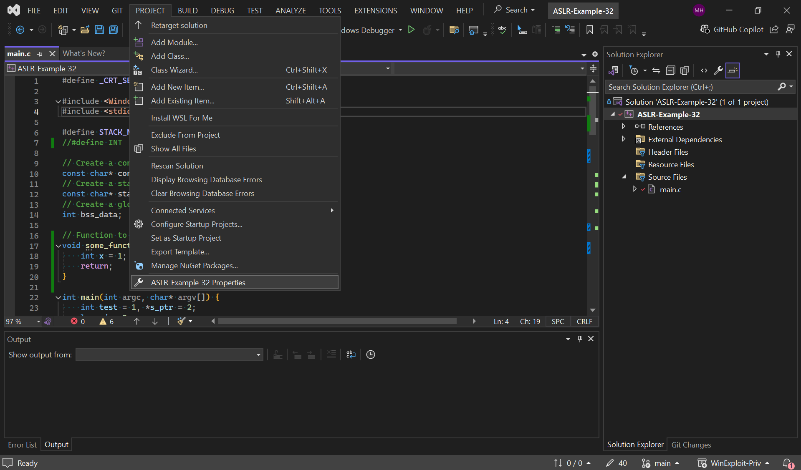

3. Open the `Linker` -> `Advanced` properties window.

   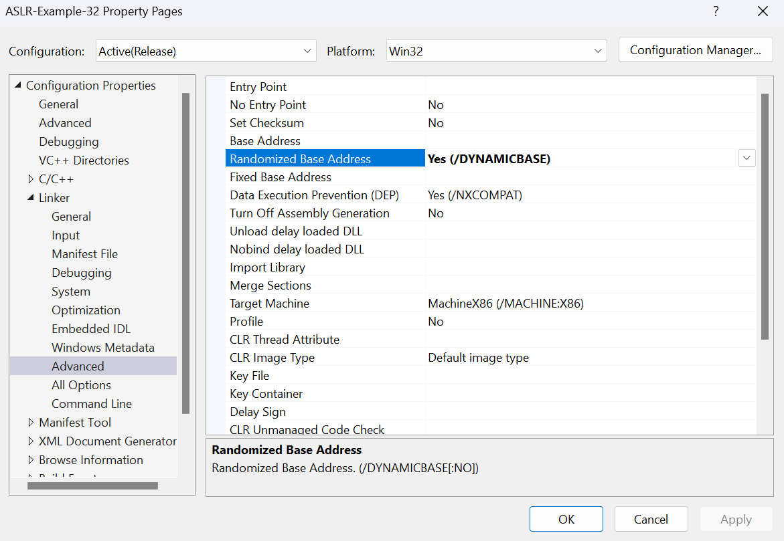

4. Ensure ASLR is enabled.

   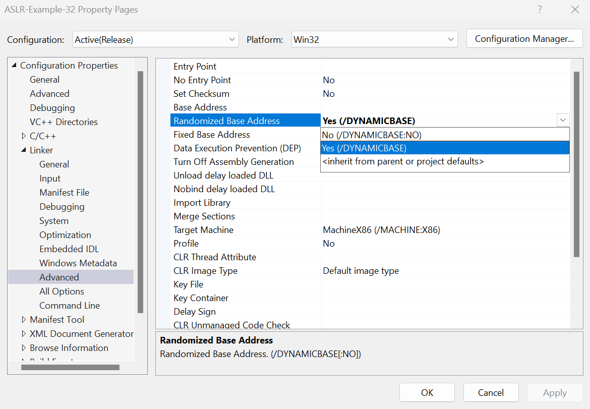

5. Compile the project, this can also be done with `Ctl+B`.

   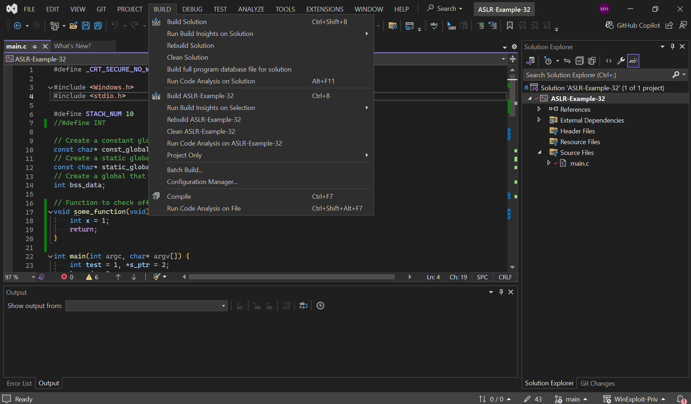

   * Ensure the `#define INT` preprocessor directive is commented out! 

6. Run the executable and observe the output.

   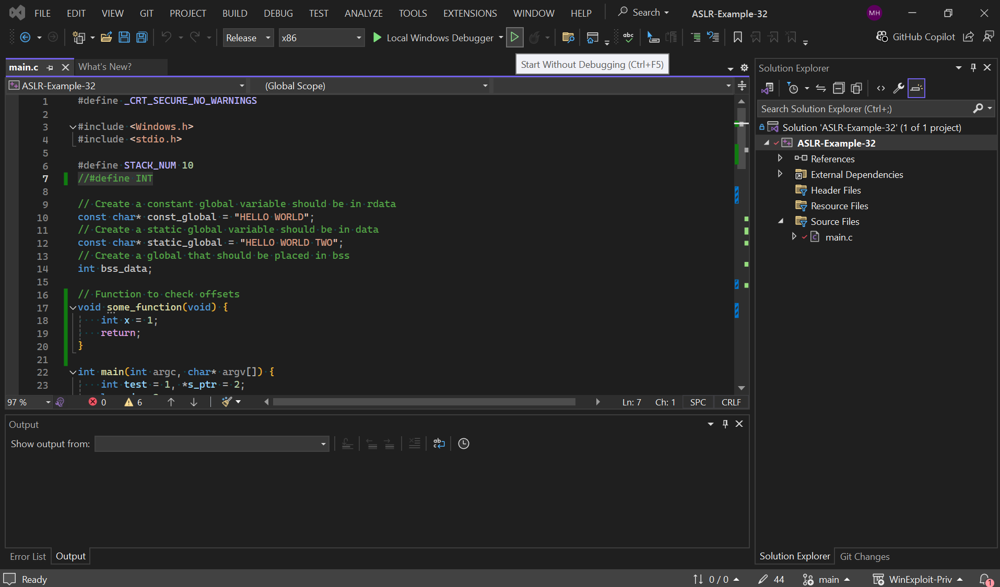 

7. You can examine the address of variables and functions between executions. 

   https://github.com/DaintyJet/VChat_ASLR_Intro/assets/60448620/e39897fd-313f-49a8-87cd-05c6fa049799

8. Recompile, to do this you can make a small modification (e.x. change the `STACK_NUM` preprocessor definition) and recompile the project. Once done execute the program and observe that the address in the `.text` section *has changed* each time the process is recompiled!

> [!NOTE]
> Notice how the addresses for variables in the `.text`, and `.data` (related) sections remain the same between executions, however the addresses of the *STACK*, *HEAP*, or Virtual Allocations change between executions when ASLR is enabled due to the *Bottom-Up ASLR*.

#### ASLR Disabled
1. Open the [`ASLR-Example-32`](./SRC/ASLR-Example-32/ASLR-Example-32.sln) Visual Studio Project.
2. Open the Properties Window for the project.

   

3. Open the `Linker` -> `Advanced` properties window.

   

4. Ensure ASLR is disabled.

   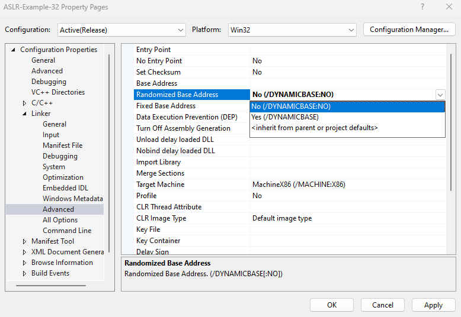

5. Compile the project, this can also be done with `Ctl+B`.

   

   * Ensure the `#define INT` preprocessor directive is commented out!
6. Run the executable and observe the output.

   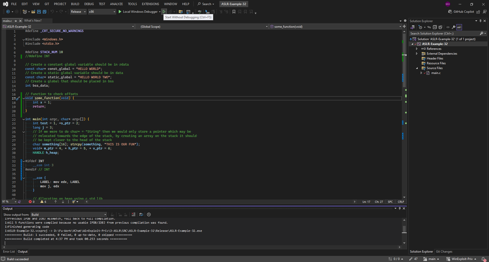 

7. You can examine the address of variables and functions between executions. 

   https://github.com/DaintyJet/VChat_ASLR_Intro/assets/60448620/be723e5e-a76b-4594-9580-979abe7ede07

8. Recompile. To do this, you can make a small modification (e.x. change the `STACK_NUM` preprocessor definition) and recompile the project. Once done execute the program and observe that the address in the `.text` section *has not changed*!

> [!NOTE]
> Notice how none of the addresses are changing! This is because ALSR has been disabled, and *Bottom-Up ASLR* is not going to be used, so all the allocations are deterministic. The HEAP allocations are less predictable in comparison to the Stack allocations, but we can see the HEAPCreate made a heap available at the same address, and for the Virtual Allocations, although the addresses changed between calls, we could see repeated values.

### Immunity Debugger
We can use Immunity Debugger to view the stack's state and observe the address changes (or lack thereof) between executions. However, Immunity Debugger can only load 32-bit executables, so the later 64-bit example will use WinDBG instead.

1. Modify [`ASLR-Example-32`](./SRC/ASLR-Example-32/ASLR-Example-32.sln) so the line `#define INT` is un-commented.

   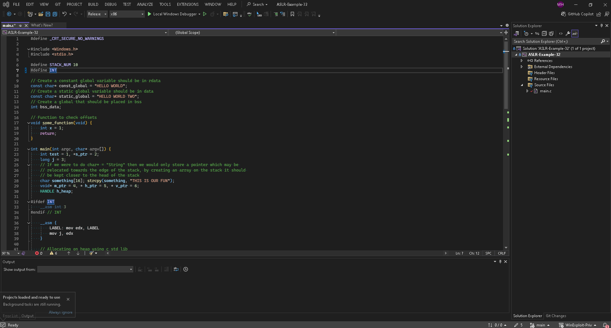 

2. Compile the [`ASLR-Example-32`](./SRC/ASLR-Example-32/ASLR-Example-32.sln) project with or without ASLR enabled. *Note* You will be repeating this again with the opposite of your current configuration.
3. Open Immunity Debugger.

    

4. Launch the [`ASLR-Example-32`](./SRC/ASLR-Example-32/ASLR-Example-32.sln) from Immunity Debugger.

   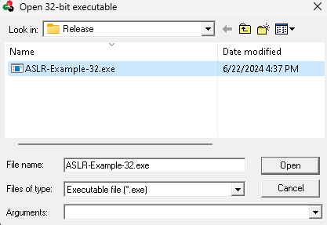 

5. Click *Run* to execute and hit the first `INT 3` instruction in the program. We can examine the stack before we start modifying the initial default values.

   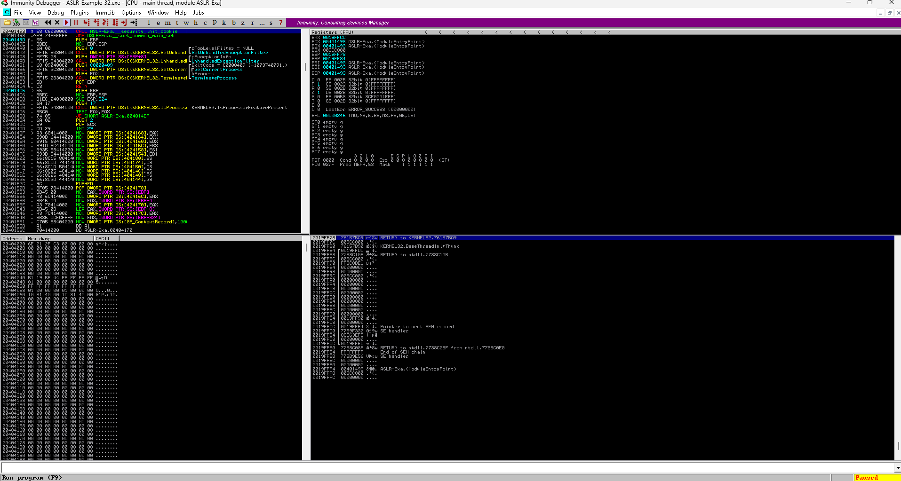 

6. We can see the stack before we start overwriting the default/initial values.

   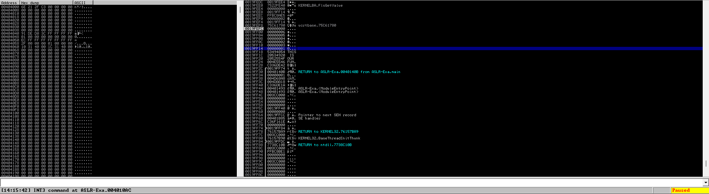 

7. Locate the ESP *Stack Pointer*; this should be apparent by the highlighting Immunity Debugger provides.

   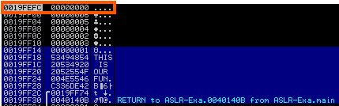 

8. Locate the *String* stored on the stack.

   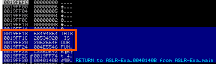 

9. Locate the address the variable *test* is stored at, this has a value of `1` based on the current source code.

   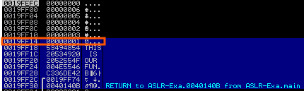 

10. Locate the *Old EBP* and *Return Address*, the *Old EBP* should be above the return address in the stack view (Remember this is a lower address as the stack grows down).

   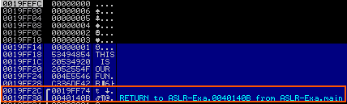

11. Locate the security cookie (We have not disabled it!). If present, it will be above the EBP value on the stack in our program, directly after the array stored on the stack.

   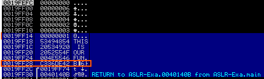

12. Click Run again. We will hit the second `INT 3` instruction in the code and be able to compare the program output to the information in the debugger.

   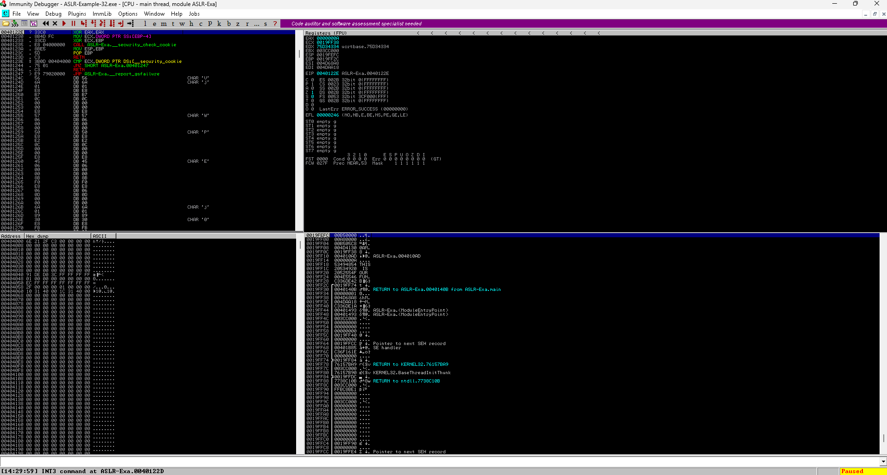

13. Locate the address from the `.text` section

   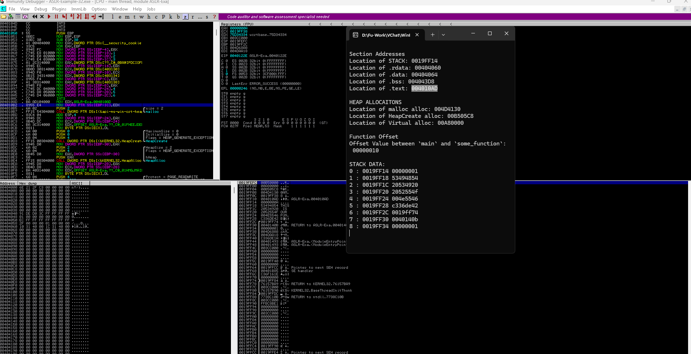

14. Observe the Stack values we printed in the console. Notice how the value of `test` has changed from the initial value of *1* to *A* due to the for loop!

   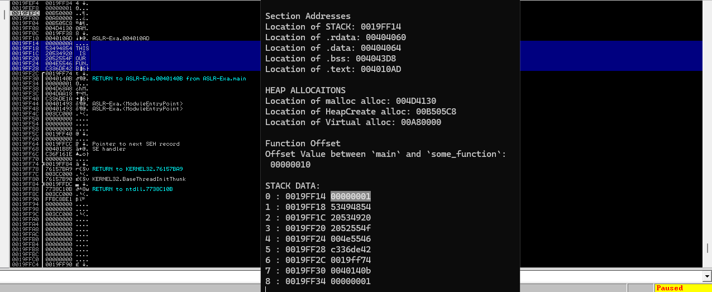

15. Re-run the program a few times, observe the addresses changing if ASLR is enabled, and staying for the most part the same if ASLR is disabled.
16. Re-compile the program with ASLR enabled if it was previously disabled, or re-compile it with ASLR disabled if it was previously enabled.

### Example Program 2 (x86_64)
We will be using [`ASLR-Example-64`](./SRC/ASLR-Example-64/ASLR-Example-64.sln), the only difference between this project and the last is it has been configured to compile into a 64-bit executable. The only modifications made were to the sections containing *Inline Assembly* which is not allowed in 64-bit programs. Instead, we use compiler intrinsic [`__debugbreak()`](https://learn.microsoft.com/en-us/cpp/intrinsics/debugbreak?view=msvc-170) to insert the `INT 3` instruction and use the entry-point of `main` as the `.text` section address.

Our code contains the following points of interest:
1. As we cannot use inline assembly to find the address of an instruction contained within the `.text` section. We store the address of `main` in the variable `j` instead of an arbitrary location in the `.text` segment.
   ```c
   j = main;
   ```
2. We perform an allocation of the process's heap using the C-Standard library function `malloc(...)`.
   ```c
   // Allocating on heap using c std lib
    m_ptr = (void*)malloc(sizeof(char) * 2);
    *((char*)m_ptr) = "A";
   ```
3. We allocate a new Heap in Virtual memory with `HeapCreate(...)` and perform an allocation within it `HeapAlloc(...)`.
   ```c
   // Allocate on a heap we allocate
    h_heap = HeapCreate(HEAP_GENERATE_EXCEPTIONS, 0, 0);
    h_ptr = HeapAlloc(h_heap, HEAP_GENERATE_EXCEPTIONS, sizeof(char) * 2);
    *((char*)h_ptr) = "B";
   ```
4. We allocate a region of Virtual Memory with `VirtualAlloc`.
   ```c
   // Virtual Allocation of a page
    v_ptr = VirtualAlloc(NULL, sizeof(char) * 2, MEM_COMMIT, PAGE_READWRITE);
    *((char*)v_ptr) = "C";
   ```
5. We allocate a constant global variable in the `.rdata` section.
   ```c
   // Create a constant global variable should be in rdata
   const char* const_global = "HELLO WORLD";
   ```
6. We allocate a static variable in the `.data` section.
   ```c
   // Create a static global variable should be in data
   static char* static_global = "HELLO WORLD TWO";
   ```
7. We allocate an object that is initially an entry in the `.bss` section in the PE file which is later mapped into a `.data` section.
   ```c
   // Create a global that should be placed in bss
   int bss_data;
   ```
8. We print out data allocated on the stack.
   ```c
   // Printing out the stack
    printf("\nSTACK DATA:\n");
    for (test, s_ptr = &test; test < STACK_NUM; test++, ++s_ptr)
        printf("%-2d: %08p %08x\n", test - 1 , (void*)s_ptr, (*s_ptr));
   ```
> [!NOTE]
>  The line `#define INT` is used to control if debugging interrupts are included in the resulting executable at locations we would like to stop execution to examine the stack.
#### ASLR Enabled
1. Open the [`ASLR-Example-64`](./SRC/ASLR-Example-64/ASLR-Example-64.sln) Visual Studio Project.
2. Open the Properties Window for the project.

   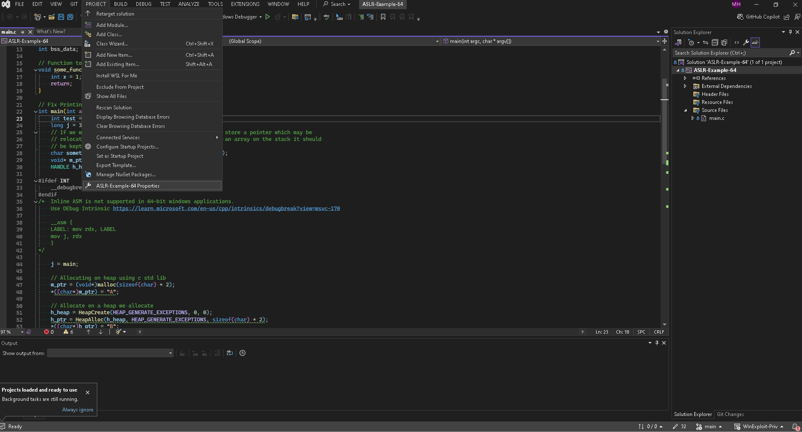

3. Open the `Linker` -> `Advanced` properties window.

   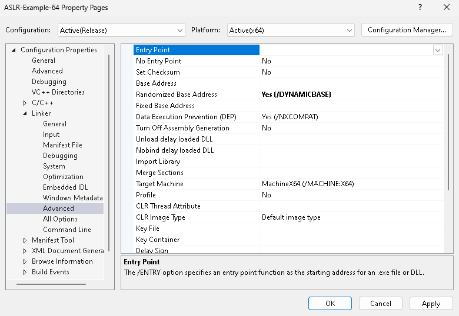

4. Ensure ASLR is enabled.

   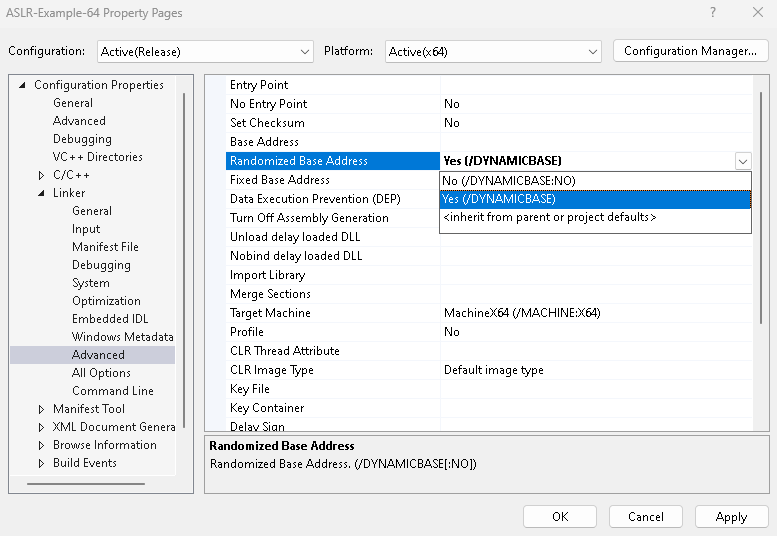

5. Compile the project, this can also be done with `Ctl+B`.

   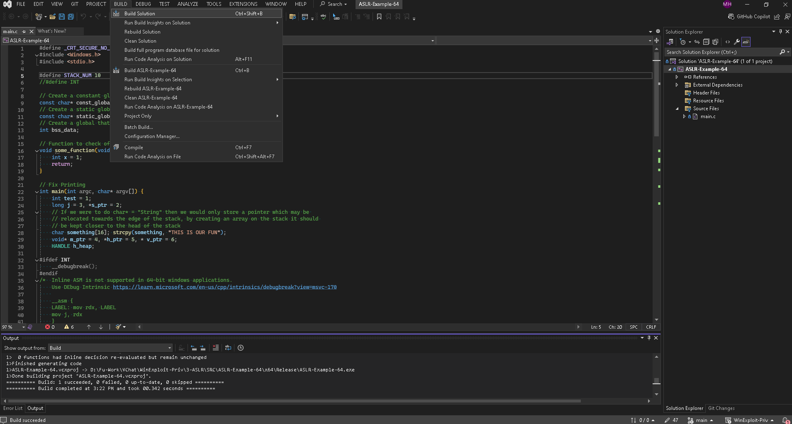

   * Ensure the `#define INT` preprocessor directive is commented out! 

6. Run the executable and observe the output.

   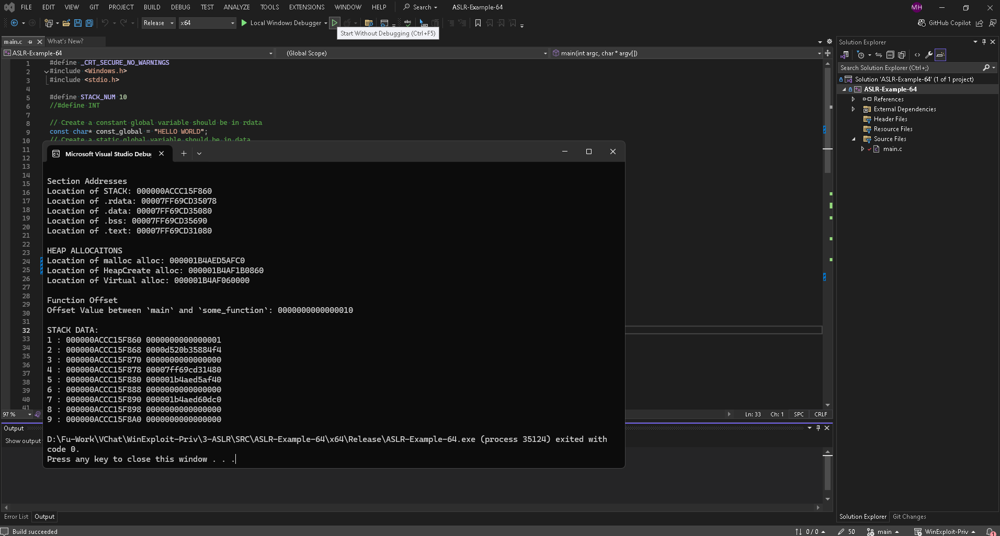

7. You can examine the address of variables and functions between executions. 

   https://github.com/DaintyJet/VChat_ASLR_Intro/assets/60448620/1fcbb417-6f13-4fe8-a13e-40694d89b92d

8. Recompile and make a small modification (e.x. change the `STACK_NUM` preprocessor definition) and recompile the project. Once done execute the program and observe that the address in the `.text` section *has changed* each time the process is recompiled!

> [!NOTE]
> Notice how the addresses for variables in the `.text`, and `.data` (related) sections remain the same between executions, however the addresses of the *STACK*, *HEAP*, or Virtual Allocations change between executions when ASLR is enabled due to the *Bottom-Up ASLR*.


#### ASLR Disabled
1. Open the [`ASLR-Example-64`](./SRC/ASLR-Example-64/ASLR-Example-64.sln) Visual Studio Project.
2. Open the Properties Window for the project.

   

3. Open the `Linker` -> `Advanced` properties window.

   

4. Ensure ASLR is disabled.

   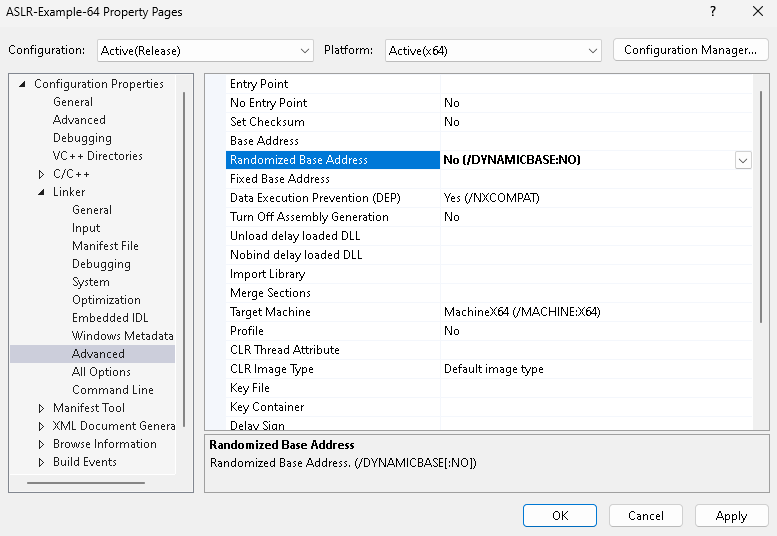

5. Compile the project, this can also be done with `Ctl+B`.

   

   * Ensure the `#define INT` preprocessor directive is commented out!
6. Run the executable and observe the output.

   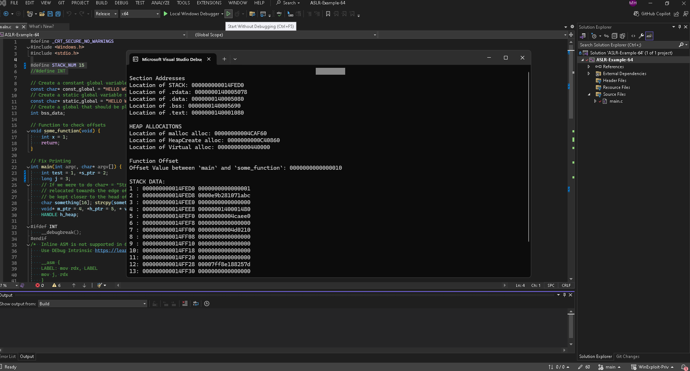

7. You can examine the address of variables and functions between executions. 

   https://github.com/DaintyJet/VChat_ASLR_Intro/assets/60448620/8ea41137-c06d-4474-b73f-83a6c91a6fc5

8. Recompile. You can make a small modification (e.x. change the `STACK_NUM` preprocessor definition) and recompile the project. Once done execute the program and observe that the address in the `.text` section *has not changed*!

> [!NOTE]
> Notice how none of the addresses are changing! This is because ALSR has been disabled, and *Bottom-Up ASLR* is not going to be used, so all the allocations are deterministic. The HEAP allocations are less predictable in comparison to the Stack allocations, but we can see the HEAPCreate made a heap available at the same address, and for the Virtual Allocations, although the addresses changed between calls, we could see repeated values.
### WinDBG
We will be using WinDBG to view the state of the program while it is executing. We are not using Immunity Debugger as it does not support 64-bit executables. 

1. Modify [`ASLR-Example-64`](./SRC/ASLR-Example-64/ASLR-Example-64.sln) so the line `#define INT` is un-commented.

    

2. Compile the [`ASLR-Example-64`](./SRC/ASLR-Example-64/ASLR-Example-64.sln) project with or without ASLR enabled. *Note* You will be repeating this again with the opposite of your current configuration.
3. Open WinDBG and attach/launch the [`ASLR-Example-64`](./SRC/ASLR-Example-64/ASLR-Example-64.sln) program.
   1. Click *File* in the top left.

      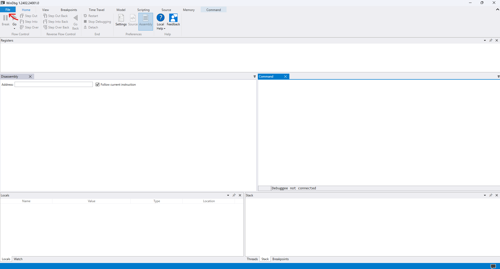 

   2. Click Launch Executable.

      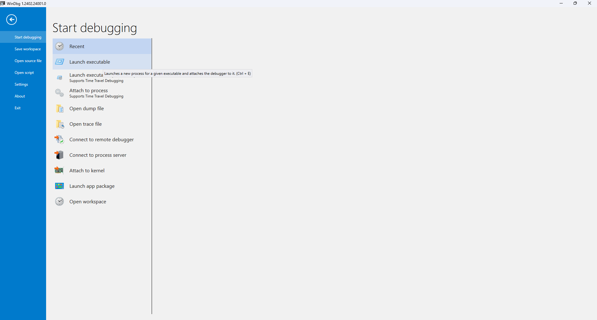 

   3. Select the EXE from the [`ASLR-Example-64`](./SRC/ASLR-Example-64/ASLR-Example-64.sln) project and click *Open*.

      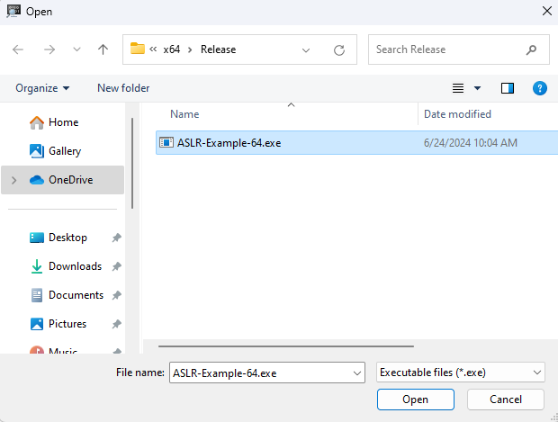 

4. Click on the *View* tab, and select *Disassembly* if it is not already visible. Do the same for *Registers*. By clicking and dragging the window we can reformat the view of WinDBG by docking it to the program window.

   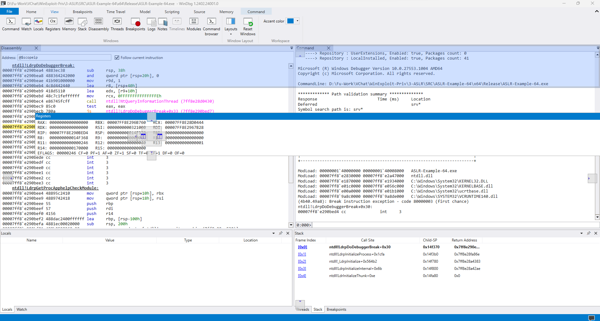 

5. Click *Go* to hit the first breakpoint

   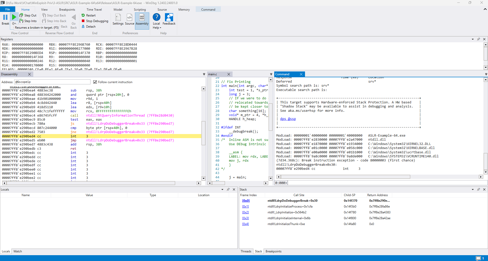 

6. At the first breakpoint, in the command window run `dps rsp rsp+100` to display *Pointer-Sized Values* starting at the address contained in `rsp` to the point `rsp + 100`.

   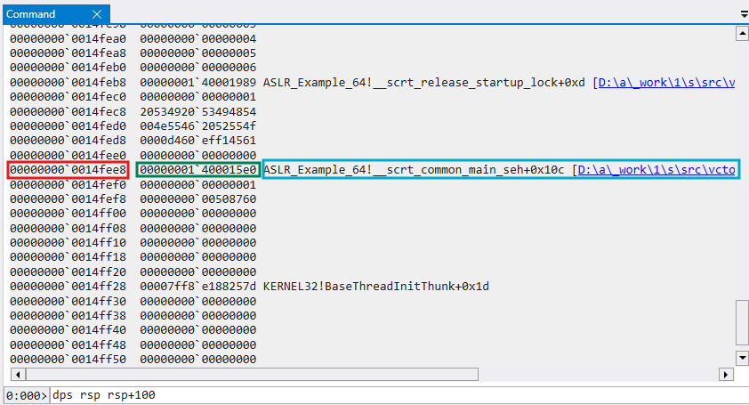

   * The first 8-bytes displayed is the virtual address of the object on the stack being displayed. In the image above, we have highlighted the address of one entry in red.
   * The second grouping of 8-bytes is the contents at that address. In this image above we have highlighted the contents of one entry in green.
   * The third entry is optional, and this is the name of a function or the contents at the location a pointer refers to. This has been highlighted in blue; in this case, the contents of the stack that has been highlighted is the address of the `ASLR_Example_64!__scrt_common_main_seh+0x10c` where `__scrt_common_main_seh` is the name of the function this address refers to.  

7. Locate the ESP *Stack Pointer* this should be the first entry printed from the command in the output. We can confirm this by looking at the address stored in the ESP register.

   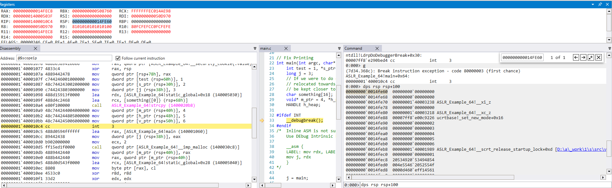 

8. Locate the *String* stored on the stack, one of the two entries should have the contents `2053492053494854`.

   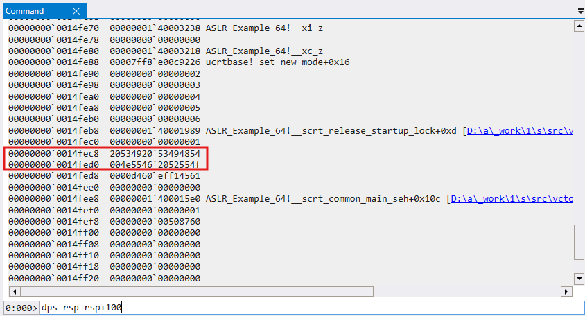 

9. Locate the address the variable *test* is stored at, this has a value of `1` based on the current source code. (We will confirm this after we hit the next breakpoint)

   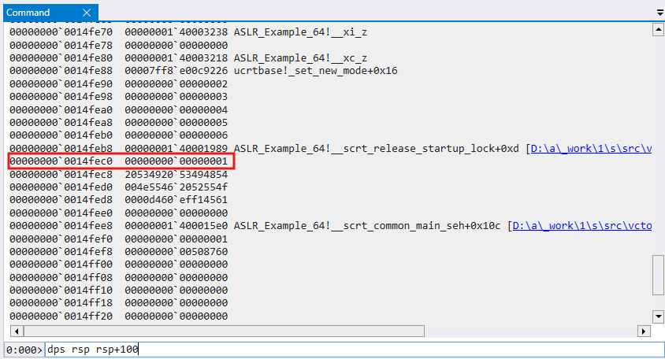

10. Locate the *Return Address*, the *Old EBP* is not stored on the stack as the 64-bit process is optimizing this away, using offset relative to the `rsp` register instead.

   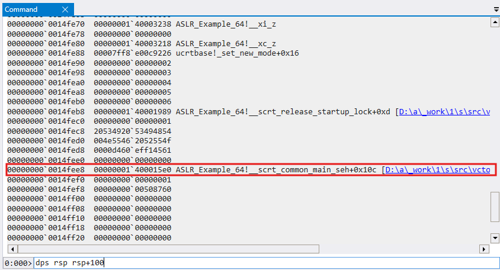

11. Locate the security cookie (We have not disabled it!), if present this will be above the *Return Address* on the stack in our program, directly after the array stored on the stack.

   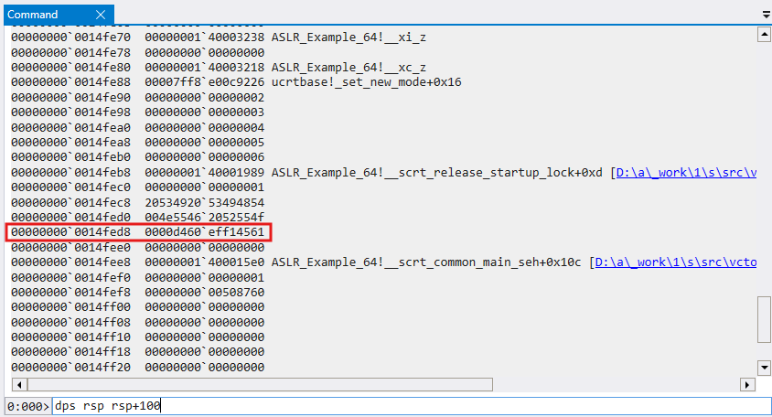

12. Click Run again, we will hit the second `INT 3` instruction in the code, and will be able to compare the program output to the information in the debugger. We can see the disassembly below.

   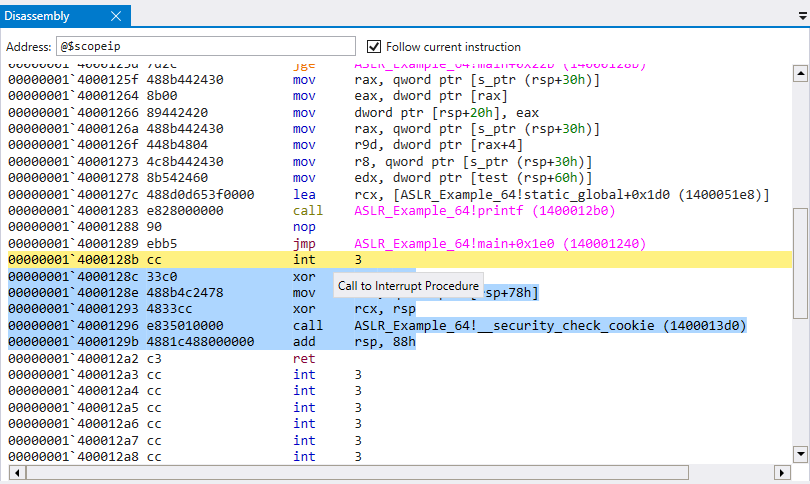 

13. Locate the address from the `.text` section

   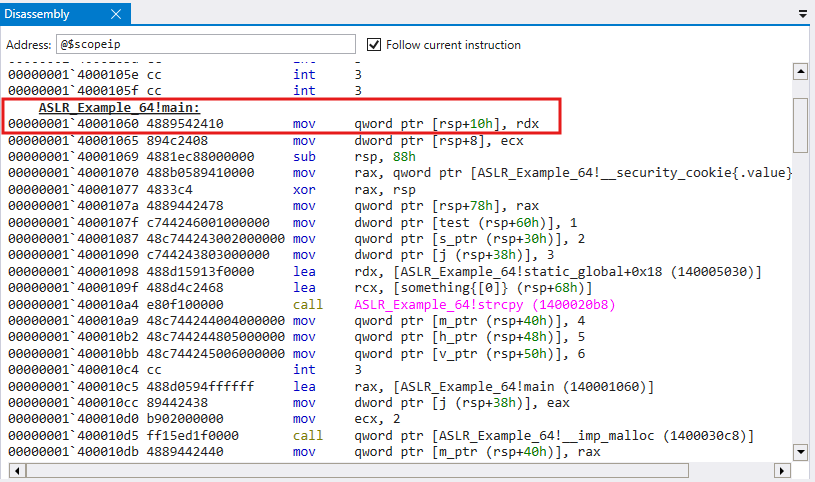

14. Run the `dps rsp rsp+100` command again and observe the Stack values we printed in the console. Notice how the value of `test` has changed from the initial value of *1* to *E* due to the for loop!

   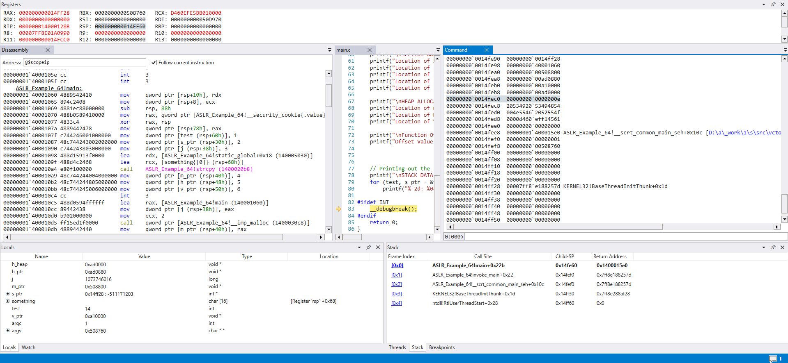

15. Re-run the program a few times, and observe the addresses changing if ASLR is enabled and staying mostly the same if ASLR is disabled.

   https://github.com/DaintyJet/VChat_ASLR_Intro/assets/60448620/86566d2a-0dc0-4b6f-b2ca-be2c2f4d4db4

16. Re-compile the program with ASLR enabled if it was previously disabled, or re-compile it with ASLR disabled if it was previously enabled.
Use WINDBG

### Exploring Entropy and Rebasing
This section will use the project [ASLR-Multi-Run](./SRC/ASLR-Multi-Run/ASLR-Multi-Run.sln) which has a simple powershell script [E3-Runner-Counter.ps1](./SRC/ASLR-Multi-Run/E3-Runner-Counter.ps1) that we will be using to automate some of the work. This script will run the executable we compile from the project, store it's output in a file and count the number of unique addresses contained within. 

#### Modifying and Compiling the Project
As with the previous examples, we will start by configuring the resulting executable's ASLR compatibility flag. Then, we will cover the various preprocessor definitions used to control the program's output.


1. Open the [ASLR-Multi-Run](./SRC/ASLR-Multi-Run/ASLR-Multi-Run.sln) project.
2. Open the Properties window of the project.

   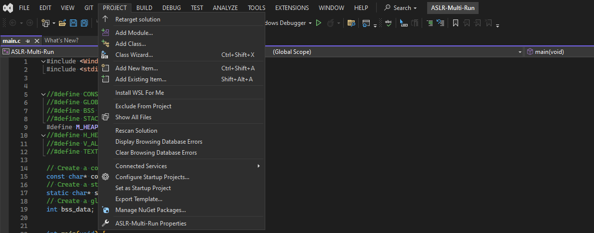

3. Open the `Linker` -> `Advanced` window.

   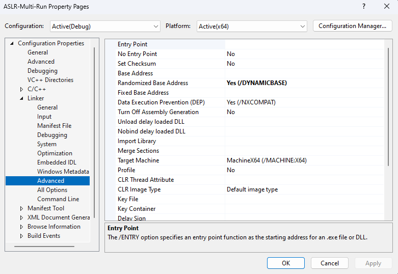

4. Modify the ASLR setting as required, you will be doing this exercise with both ASLR enabled and disabled.

   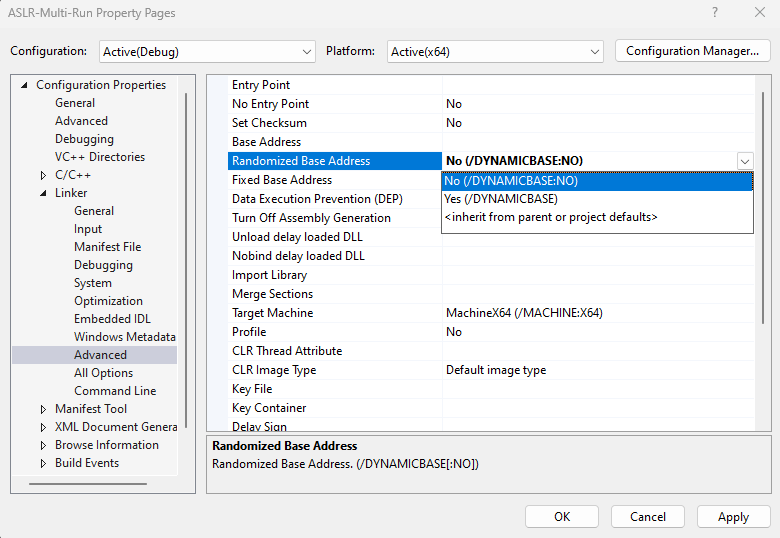

5. Uncomment one of the preprocessor defines to control which object's address the program prints when it is executed.
   * `#define CONST_GLOBAL 1`: Print the address of a global constant that should be located in the `.rdata` section.
   * `#define GLOBAL 1`: Print the address of a global variable that should be located in the `.data` section.
   * `#define BSS 1`: Print the address of a global variable that was initially defined in the `.bss` section of a PE file.
   * `#define STACK 1`: Print the address of a value on the stack.
   * `#define M_HEAP 1`: Print the address of a value allocated on the heap by the C-Standard function `malloc(...)`.
   * `#define H_HEAP 1`: Print the address of a value on a heap we created with `HeapCreate(...)`.
   * `#define V_ALLOC 1`: Print the address of a region of Virtual Memory we allocated with `VirtualAlloc(...)`
   * `#define TEXT_P 1`: Print the address of the main function.
6. Recompile the project, you can use `Ctl + B` or the dropdown menu as shown below.

   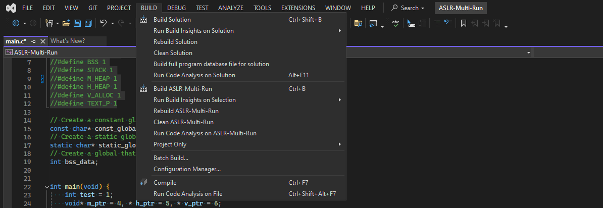

#### Using the Powershell Script
> [!IMPORTANT]
> As this is a simple Powershell script, when modifying the number of times it will execute the process, we need to keep in mind that this may not be able to handle or run particularly fast if we were to use a very large number as our limit for iterations.


1. Open a powershell window and navigate to the [ASLR-Multi-Run](./SRC/ASLR-Multi-Run/) directory.

   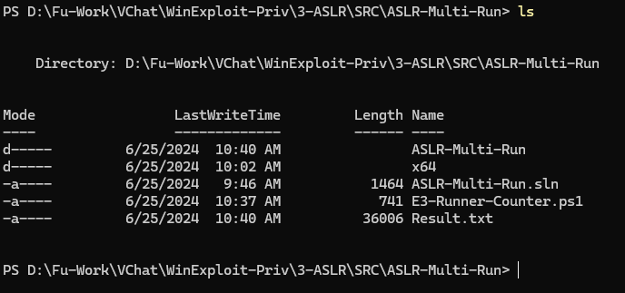

2. Modify the [E3-Runner-Counter.ps1](./SRC/ASLR-Multi-Run/E3-Runner-Counter.ps1) powershell script.
   * If you have made the 64-bit executable into a 32-bit executable or moved it to another directory you will need to modify the line containing the path to the executable to reflect this change.
      ```
      &".\x64\Debug\ASLR-Multi-Run.exe" | Out-File -Append -FilePath .\Result.txt
      ```
      * In this case you would modify the `.\x64\Debug\ASLR-Multi-Run.exe` entry.
   * If you would like to modify the number of iterations that occur, you can edit the *limit* variable
      ```
      $limit = 1000
      ```
      * In this case we are running the executable *1000* times.
3. Run the powershell script and observe the output. 

   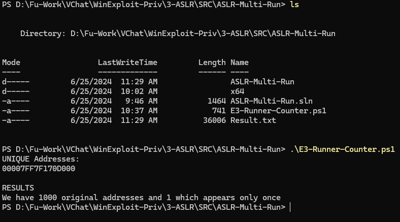

4. Modify the preprocessor definitions in the [ASLR-Multi-Run](./SRC/ASLR-Multi-Run/ASLR-Multi-Run.sln) project, recompile, and re-run the powershell script.
5. Compare the results of the executable when ASLR is enabled and when ASLR is disabled.

> [!NOTE]
> Pay close attention to the *Stack* allocations, *Malloc Heap* allocations, *Heap Create* allocations and the *Virtual Address* allocations when ASLR is enabled compared to when it has been disabled.

## References
[[1] Windows ISV Software Security Defenses](https://docs.microsoft.com/en-us/previous-versions/bb430720(v=msdn.10)?redirectedfrom=MSDN)

[[2] Peering Inside the PE: A Tour of the Win32 Portable Executable File Format](https://docs.microsoft.com/en-us/previous-versions/ms809762(v=msdn.10)#pe-file-base-relocations)

[[3] Windows 8 ASLR Internals](https://web.archive.org/web/20210804152004/http://blog.ptsecurity.com/2012/12/windows-8-aslr-internals.html)
<!-- http://blog.ptsecurity.com/2012/12/windows-8-aslr-internals.html Old site is down-->

[[4] Mitigate threats by using Windows 10 security features](https://docs.microsoft.com/en-us/windows/security/threat-protection/overview-of-threat-mitigations-in-windows-10)

[[5] When "ASLR" Is Not Really ASLR - The Case of Incorrect Assumptions and Bad Defaults](https://insights.sei.cmu.edu/blog/when-aslr-is-not-really-aslr-the-case-of-incorrect-assumptions-and-bad-defaults/)

[[6] Differences Between ASLR on Windows and Linux](https://insights.sei.cmu.edu/blog/differences-between-aslr-on-windows-and-linux/)

[[7] Six Facts about Address Space Layout Randomization on Windows](https://cloud.google.com/blog/topics/threat-intelligence/six-facts-about-address-space-layout-randomization-on-windows)

[[8] Software defense: mitigating common exploitation techniques](https://msrc-blog.microsoft.com/2013/12/11/software-defense-mitigating-common-exploitation-techniques/)

[[9] An Analysis of Address Space Layout Randomization on Windows Vista](https://www.blackhat.com/presentations/bh-dc-07/Whitehouse/Paper/bh-dc-07-Whitehouse-WP.pdf)

[[10] Clarifying the behavior of mandatory ASLR](https://msrc-blog.microsoft.com/2017/11/21/clarifying-the-behavior-of-mandatory-aslr/)

[[11] On the effectiveness of DEP and ASLR](https://msrc-blog.microsoft.com/2010/12/08/on-the-effectiveness-of-dep-and-aslr/)

[12] Peter Vreugdenhil.  Pwn2Own 2010 Windows 7 Internet Explorer 8 Exploit.  March, 2010.

[[13] Customize exploit protection](https://learn.microsoft.com/en-us/defender-endpoint/customize-exploit-protection)

[[14] Windows 8 and later fail to properly randomize every application if system-wide mandatory ASLR is enabled via EMET or Windows Defender Exploit Guard](https://www.kb.cert.org/vuls/id/817544)

[[15] Exploit protection reference](https://learn.microsoft.com/en-us/defender-endpoint/exploit-protection-reference#randomize-memory-allocations-bottom-up-aslr)

[[16] Comparing Memory Allocation Methods](https://learn.microsoft.com/en-us/windows/win32/memory/comparing-memory-allocation-methods)
<!-- ## Additional  
Discuss this https://learn.microsoft.com/en-us/cpp/build/reference/highentropyva-support-64-bit-aslr?view=msvc-170


ASLR Implmented for older systems https://web.archive.org/web/20091225114459/http://www.codeplex.com/wehntrust
### Possible 
https://web.archive.org/web/20190715102700/http://www.symantec.com/avcenter/reference/Address_Space_Layout_Randomization.pdf

https://nordsecurity.com/blog/binary-memory-protection-windows-os

PAX on Linux implemented ASLR first -- https://grsecurity.net/PaX-presentation.pdf -->

